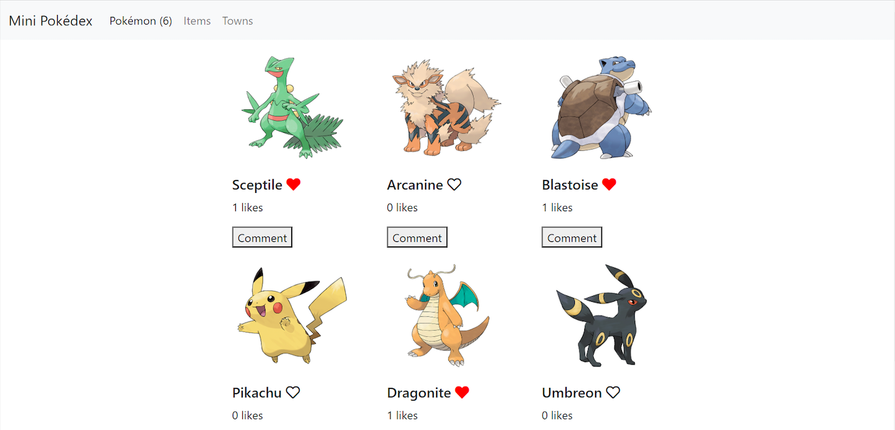

# Mini Pokédex

> A Mini Pokédex app which uses the Pokeapi API to retrieve and show information about Pokémon



## Getting Started

### Prerequisites

- [Webpack](https://webpack.js.org/)

### Setup

* Clone this repository
```
git clone https://github.com/crgc/microverse-js-capstone.git
```
* Change into folder
```
cd microverse-js-capstone
```
* Install dependencies
```
npm install
```

### Run
* Build
```
npm run build
```
* Start server
```
npm start
```
* Open your browser at http://localhost:8080/

### Tests
* Run Jest test suite
```
npm test
```

## Built With

- HTML5 & CSS3
- Javascript
- Webpack

## Live Demo
[Mini Pokédex](https://crgc.github.io/microverse-js-capstone/)

## Video Presentation
[Loom link](https://www.loom.com/share/e73e19d426fe435ca289de30e635dead)

## Authors

👤  **Carlos González**
- GitHub: [@crgc](https://github.com/crgc)
- Twitter: [@aclerkofpomier](https://twitter.com/aclerkofpomier)
- LinkedIn: [Carlos González](https://www.linkedin.com/in/carlosrmgonzalez/)

👤 **Temitope Grace**
- GitHub: [Gracetemitope](https://github.com/gracetemitope)
- Twitter: [@DevGrachy](https://twitter.com/devgrachy)
- LinkedIn: [Ajanaku Temitope](https://www.linkedin.com/in/ajanaku-temitope/)

## Show your support

Give a ⭐️ if you like this project!

## Acknowledgments

- Microverse

## 📝 License

This project is [MIT](https://www.mit.edu/~amini/LICENSE.md) licensed.